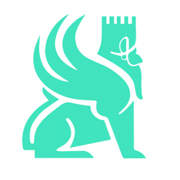

### Hello World, I'm Sadjad, Data Scientist | Machine Learning/MLOps Engineer | Computational Neuroscientist (Ph.D.)! 👋

- Data Scientist and MLOps Engineer with a strong background in computational neuroscience and over 8 years of experience in machine learning, data analysis, and brain simulations.
- Proficient in Python (Pandas, NumPy, SciPy, Scikit-learn), TensorFlow, PyTorch, Keras, and well-versed in computer vision techniques and deep learning architectures (CNNs, OpenCV).
- Experienced in developing and deploying end-to-end AI/ML solutions, including real-time systems such as a blood cell classification tool using TensorFlow, FastAPI, and OpenCV.
- Skilled in containerization (Docker, Kubernetes) and cloud infrastructure (AWS, Microsoft Azure), with automated CI/CD pipelines for seamless deployment (Git, GitHub Actions, Azure DevOps).
- Expertise in database management with SQL and NoSQL solutions (MongoDB), combined with a solid understanding of data visualization tools like Matplotlib, Seaborn, and Plotly.
- Developer of automated monitoring and logging systems utilizing Prometheus and Grafana for cloud-based applications.
- Published research in top-tier neuroscience journals, applying advanced machine learning techniques for fMRI data analysis and Bayesian statistical modeling.
- Lead contributor to developing APIs and deployment pipelines using tools such as Flask, FastAPI, Docker, Terraform, and Azure Pipelines.
- Passionate about applying machine learning, deep learning, and AI technologies to solve complex problems across multiple domains, including healthcare and finance.
- Open to collaborations on projects related to data science, MLOps, AI/ML pipelines.

<h3 align="left">Connect with me:</h3>

---

### 🏅 Professional Badges and Credentials

  
    

---
<h3 align="left">Skills:</h3>

  <!-- Python -->
   
  <!-- Pandas -->
   
  <!-- NumPy -->
  
  <!-- SciPy -->
  
  <!-- Scikit-learn -->
  
  <!-- Flask -->
  
  <!-- FastAPI -->
  
  <!-- TensorFlow -->
   
  <!-- Keras -->
  
  <!-- PyTorch -->
  
  <!-- OpenCV -->
   
  <!-- Microsoft Azure -->
   
  <!-- AWS -->
   
  <!-- Matplotlib -->
  
  <!-- Seaborn -->
  
  <!-- Plotly -->
  
  <!-- MongoDB -->
   
  <!-- SQL -->
  
  <!-- Docker -->
   
  <!-- Kubernetes -->
  
  <!-- Terraform -->
  
  <!-- Helm -->
  
  <!-- Git -->
  
  <!-- GitHub -->
  
  <!-- Azure DevOps -->
  
  <!-- MLflow -->
  
  <!-- DVC -->
  
  <!-- Airflow -->
  
  <!-- Bash -->
   
  <!-- Linux -->
   
  <!-- Windows -->
  
  <!-- Prometheus -->
  
  <!-- Grafana -->
  
  <!-- Jira -->
  
  <!-- Confluence -->
  
  <!-- VS Code -->
  
  <!-- Streamlit -->
  

&nbsp;

---

### Projects

<table>
  <tr>
    <th>Projects</th>
    <th>Techniques</th>
    <th>Data Types</th>
    <th>Poster</th>
  </tr>
