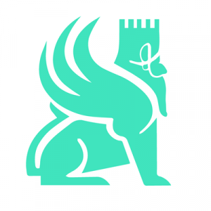
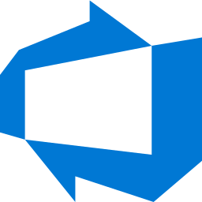
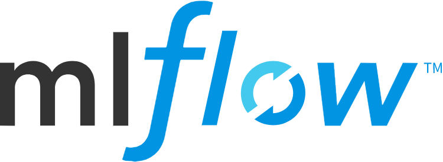
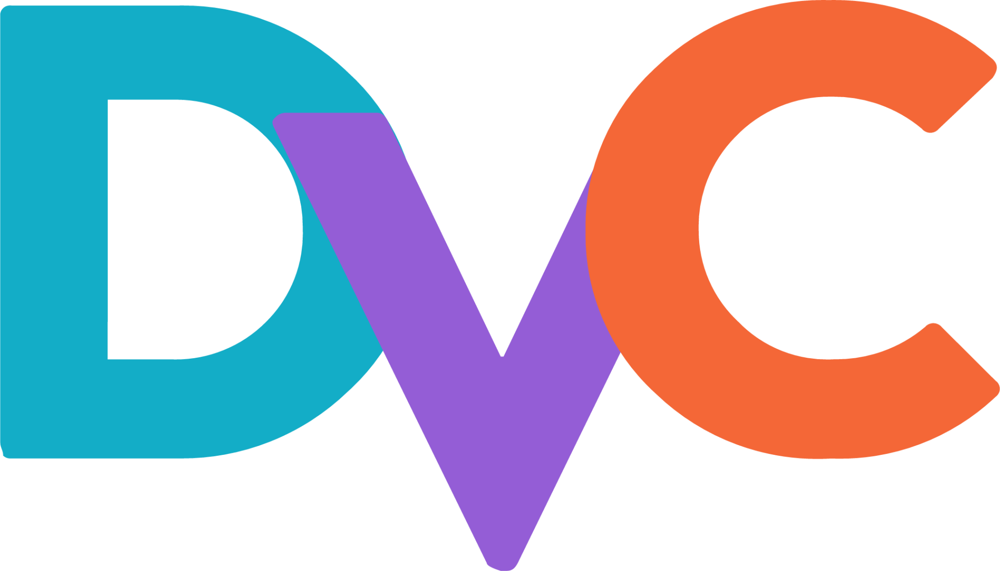
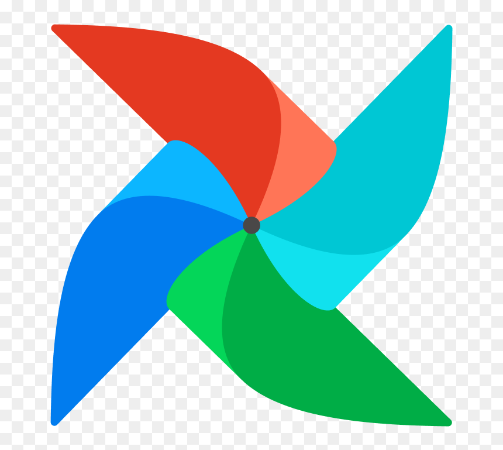
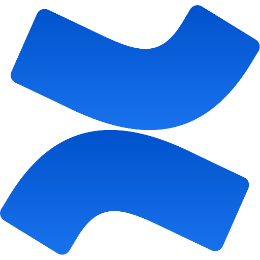
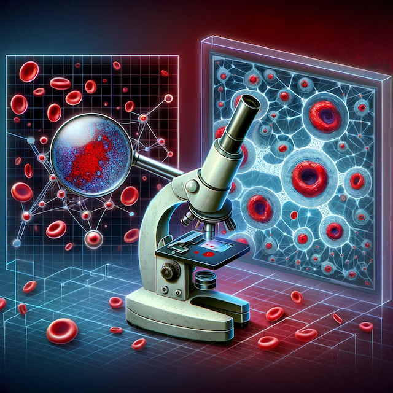

### Hello World, I'm Sadjad, Data Scientist | Machine Learning/MLOps Engineer | Computational Neuroscientist (Ph.D.)! 👋

- Data Scientist and MLOps Engineer with 8+ years in machine learning, data analysis, and brain simulations.
- Proficient in Python, TensorFlow, PyTorch, Keras, and computer vision (CNNs, OpenCV).
- Developed AI/ML solutions, including a real-time blood cell classification system.
- Skilled in Docker, Kubernetes, AWS, and Azure with CI/CD automation (Git, GitHub Actions, Azure DevOps).
- Expertise in SQL, NoSQL (MongoDB), and data visualization (Matplotlib, Seaborn, Plotly).
- Experience with cloud monitoring using Prometheus and Grafana.
- Published research applying machine learning to fMRI data and Bayesian modeling.
- Developed APIs and deployment pipelines with Flask, FastAPI, Docker, and Terraform.
- Passionate about using AI/ML to solve complex problems in healthcare and finance.
- Open to collaborations on projects related to data science, MLOps, AI/ML pipelines.

<h3 align="left">Connect with me:</h3>

---

### 🏅 Professional Badges and Credentials

<table>
  <tr>
    <td align="center">
      <a href="https://files.datascientest.com/diploma/1168720e-2438-4bf6-9cca-4930562ee26f.pdf">
        
         Machine Learning Engineer Diploma
      </a>
    </td>
    <td align="center">
      <a href="https://files.datascientest.com/diploma/32b1d4b9-6658-45e6-8716-a616479e7783.pdf">
        
         Data Science Diploma
      </a>
    </td>
    <td align="center">
      <a href="https://learn.microsoft.com/api/credentials/share/en-us/SadjadSadeghi-5193/75737191D3780AC0?sharingId=86425B7D613245BB">
        
         Azure Fundamentals
      </a>
    </td>
  </tr>
</table>

---

<h3 align="left">Skills:</h3>

  <!-- Python -->
  
  <!-- Pandas -->
  
  <!-- NumPy -->
  
  <!-- SciPy -->
  
  <!-- Scikit-learn -->
  
  <!-- Flask -->
  
  <!-- FastAPI -->
  
  <!-- TensorFlow -->
  
  <!-- Keras -->
  
  <!-- PyTorch -->
  
  <!-- OpenCV -->
  
  <!-- Microsoft Azure -->
  
  <!-- AWS -->
  
  <!-- Matplotlib -->
  
  <!-- Seaborn -->
  
  <!-- Plotly -->
  
  <!-- MongoDB -->
  
  <!-- SQL -->
  
  <!-- Docker -->
  
  <!-- Kubernetes -->
  
  <!-- Terraform -->
  
  <!-- Helm -->
  
  <!-- Git -->
  
  <!-- GitHub -->
  
  <!-- Azure DevOps -->
  
  <!-- MLflow -->
  
  <!-- DVC -->
  
  <!-- Airflow -->
  
  <!-- Bash -->
  
  <!-- Linux -->
  
  <!-- Windows -->
  
  <!-- Prometheus -->
  
  <!-- Grafana -->
  
  <!-- Jira -->
  
  <!-- Confluence -->
  
  <!-- VS Code -->
  
  <!-- Streamlit -->
  

&nbsp;

---

### Projects

<table>
  <tr>
    <th>Projects</th>
    <th>Techniques</th>
    <th>Data Types</th>
    <th>Poster</th>
  </tr>
  <tr>
    <td>
      <a href="https://github.com/sadjad6/self-improving-llm-kb.git"><strong>Self-Improving LLM Knowledge Base</strong></a> 
      <em>Production-grade RAG system with hybrid retrieval (FAISS + BM25), persistent self-improving memory that learns from user interactions, and a feedback loop that automatically generates and integrates new knowledge summaries back into the knowledge base.</em>
    </td>
    <td>Retrieval-Augmented Generation (RAG), Hybrid Retrieval (FAISS Dense Vectors + BM25 Sparse), Reciprocal Rank Fusion (RRF), Semantic Chunking, Grounded LLM Reasoning, Self-Improving Memory Loop, Persistent Knowledge Store, Importance Scoring, Query Deduplication, Semantic Similarity Search, Anti-Hallucination Prompting, LLM-as-Judge Evaluation, Experiment Tracking (MLflow), Fine-grained Architecture Design, Context Engineering</td>
    <td>Markdown Documents, Text Queries, User Questions, Natural Language Input, Configuration Files (YAML), API Responses, Chat Messages, Structured Metadata</td>
    <td></td>
  </tr>
  <tr>
    <td>
      <a href="https://github.com/sadjad6/predictive-maintenance-mlops-system.git"><strong>Predictive Maintenance MLOps</strong></a> 
      <em>End-to-end predictive maintenance system using machine learning and MLOps principles. Includes failure prediction, remaining useful life estimation, anomaly detection, and interactive Power BI & Tableau dashboards for industrial decision-making.</em>
    </td>
    <td>Failure Classification, Remaining Useful Life (RUL) Regression, Anomaly Detection, Time-Series Modeling, Ensemble Methods, XGBoost, LightGBM, LSTM, Isolation Forest, Autoencoder, Feature Engineering, SHAP Explainability, Cost-Sensitive Learning, What-If Simulation, MLOps Orchestration</td>
    <td>IoT Sensor Data (CSV/Parquet), Real-Time Sensor Readings (Temperature, Vibration, Pressure, Rotation Speed), Historical Sensor Telemetry, Maintenance Logs, REST API Payloads (JSON)</td>
    <td></td>
  </tr>
  <tr>
    <td>
      <a href="https://github.com/sadjad6/recsys-ml-platform.git"><strong>RecSys ML Platform</strong></a> 
      <em>Production-grade real-time recommendation system with microservices, Kafka/Spark pipelines, MLflow lifecycle management, online learning, A/B testing, and Prometheus/Grafana monitoring, deployed via Docker and Kubernetes.</em>
    </td>
    <td>Microservices Architecture, Collaborative Filtering (ALS), Online Learning (Incremental Embeddings), A/B Testing (Deterministic Hashing), Streaming Data Processing (Kafka + Spark), Feature Engineering, Model Serving, FastAPI, MLflow Registry, Prometheus/Grafana Monitoring, Docker/Kubernetes Orchestration, Redis Caching, Delta Lake, Data Drift Detection (Evidently)</td>
    <td>Clickstream Events (clicks, views, ratings), User Interaction Payloads, JSON API Requests, Kafka Event Streams</td>
    <td></td>
  </tr>
  <tr>
    <td>
      <a href="https://github.com/sadjad6/agentic-enterprise-rag-langgraph.git"><strong>Enterprise RAG Assistant</strong></a> 
      <em>GDPR-compliant, agentic RAG system with LangGraph, hybrid LLMs (Ollama + GPT), and enterprise document retrieval.</em>
    </td>
    <td>LLM (Ollama + GPT-4o-mini), LangChain, LangGraph, Agentic Workflow, RAG, Hybrid Search (Vector + BM25), Prompt Engineering, GDPR Compliance, PII Anonymization, Multilingual NLP, FastAPI, Weaviate Vector DB, Document Processing, Token Counting, Language Detection</td>
    <td>Text, PDF, Markdown, CSV/Structured Documents, JSON, API Data, Embeddings, User Queries, Cost Metrics, API Responses, Chat Messages, Document Metadata</td>
    <td></td>
  </tr>
  <tr>
    <td>
      <a href="https://github.com/sadjad6/open-autonomous-research-lab.git"><strong>Open Autonomous Research Lab (OARL)</strong></a> 
      <em>A multi-agent AI platform for autonomous data analysis, ML experimentation, research discovery, and report generation.</em>
    </td>
    <td>Multi-Agent System, Agentic Workflow, Orchestration Agents, Ensemble Learning (XGBoost, LightGBM), Statistical Analysis (SciPy, Statsmodels), Vector Database (ChromaDB), RAG (Retrieval-Augmented Generation), Experiment Tracking (MLflow), MCP Servers, Prompt Engineering, FastAPI REST Architecture, Streamlit UI</td>
    <td>CSV, Pandas DataFrames, NumPy Arrays, JSON, PyArrow Tables, SQL Databases, Text Reports, Experiment Metadata, Vector Embeddings, Excel Files, Tabular Data, Time Series Data</td>
    <td></td>
  </tr>
  <tr>
    <td>
      <a href="https://github.com/sadjad6/aegis-claims-ai-platform.git"><strong>AegisClaims AI</strong></a> 
      <em>AegisClaims AI is a production-grade, multi-tenant B2B SaaS platform that provides AI-powered, autonomous insurance claims triage and decisioning for motor and property insurance.</em>
    </td>
    <td>LLM (AWS Bedrock), Multi-Agent AI System, RAG (Retrieval-Augmented Generation via OpenSearch), ML-based Fraud Detection (AWS SageMaker), Clean Architecture, Agentic Orchestration, NLP, OCR, RBAC, Multi-Tenancy, Audit Trails, Prompt Engineering</td>
    <td>Claims Data, Insurance Policy Documents, Unstructured Documents (OCR), Claim Metadata, Fraud Detection Signals, User Profile Data, Tenant Configuration Data, Audit Logs, Prompt Templates, Model Evaluation Datasets</td>
    <td></td>
  </tr>
  <tr>
    <td>
      <a href="https://github.com/sadjad6/agent_eval_lab.git"><strong>RL Environment Framework</strong></a> 
      <em>Production-grade deterministic RL environment framework for training and evaluating LLM-style agents without external APIs.</em>
    </td>
    <td>Reinforcement Learning (RL), PPO (Proximal Policy Optimization), Generalized Advantage Estimation (GAE), Deterministic Environment Simulation, Out-Of-Distribution (OOD) Evaluation, Distribution Shift Analysis, Deterministic Judging, Policy Gradient Methods, Stability Instrumentation, YAML Configuration, PyTorch, Docker, Pytest, GitHub Actions, CI/CD Automation</td>
    <td>Synthetic Datasets, Feature Vectors (32-dimensional), Classification Labels (5 classes), Train/Validation Splits, Policy Checkpoints, Metrics Logs (JSON), YAML Configurations, Covariance Matrices, Class Priors, Reward Signals, Gradient Data, Entropy Values, KL Divergence Metrics, Accuracy Scores, Generalization Gap Data</td>
    <td></td>
  </tr>
  <tr>
    <td>
      <a href="https://github.com/sadjad6/FinSage.git"><strong>FinSage: AI-Powered Financial Advisor</strong></a> 
      <em>Autonomous multi-agent system for financial and investment advising, helping users make data-driven decisions across various asset classes including stocks, ETFs, bonds, and cryptocurrencies.</em>
    </td>
    <td>LLM (Gemma3 via Ollama), LangChain, LangGraph, Agentic Workflow, FinBERT, RAG, Prompt Engineering, MCP (Modular Contextual Pipeline), Gradio UI</td>
    <td>Text, CSV, JSON, API Data, News Articles, User Profile Data, Scheduling Settings</td>
    <td></td>
  </tr>
  <tr>
    <td>
      <a href="https://github.com/sadjad6/personal_knowledge_agent.git"><strong>Personal Knowledge Management Agent</strong></a> 
      <em>Context-aware Q&A over personal notes (Markdown, Notion exports, Obsidian vaults), with daily summarization and learning digest via autonomous agents.</em>
    </td>
    <td>LLM (Gemma3 via Ollama), LlamaIndex, Qdrant, RAG, Agentic Scheduling, Prompt Engineering, LangChain</td>
    <td>Text, Markdown, Notion/Obsidian Exports</td>
    <td></td>
  </tr>
  <tr>
    <td>
      <a href="https://github.com/sadjad6/pdf_RAG_chatbot.git"><strong>PDF Q&A RAG</strong></a> 
      <em>DeepSeek-R1 PDF Q&A Assistant.</em>
    </td>
    <td>LLM (DeepSeek-R1), HuggingFace Embeddings, Vector Search, Sentence Splitting, Prompt Engineering, Streaming Responses</td>
    <td>Text, PDFs</td>
    <td></td>
  </tr>
  <tr>
    <td>
      <a href="https://github.com/sadjad6/Text-Summarizer.git"><strong>Text-Summarizer</strong></a> 
      <em>Pegasus Text Summarization.</em>
    </td>
    <td>Transformers (Pegasus), Fine-Tuning, Data Augmentation, Tokenization, Beam Search, Length Penalty, CI/CD (GitHub Actions), FastAPI, Docker, AWS</td>
    <td>Text (Dialogues, Summaries)</td>
    <td></td>
  </tr>
  <tr>
    <td>
      <a href="https://github.com/sadjad6/CNN-Predictor-for-Malaria_Cells-LIME-CAM.git"><strong>Malaria Cell Classifier</strong></a> 
      <em>Deep Convolutional Neural Networks and Machine Learning Models for Anomaly Detection in Microscopic Malaria cells.</em>
    </td>
    <td>Deep CNN, Data Augmentation, Feature Engineering, Image Processing, Optimization</td>
    <td>Image</td>
    <td></td>
  </tr>
  <tr>
    <td>
      <a href="https://github.com/sadjad6/Automated-Cell-Semantic-Segmentation-with-UNet.git"><strong>Automated Nucleus Detector</strong></a> 
      <em>A Semantic Segmentation Solution for Automating Nucleus Detection of Microscopic Biomedical Images.</em>
    </td>
    <td>U-Net, Keras-tuner, Semantic Segmentation</td>
    <td>Image</td>
    <td></td>
  </tr>
  <tr>
    <td>
      <a href="https://github.com/sadjad6/movie-recommendation-systems.git"><strong>Movie Recommendation Systems</strong></a> 
      <em>A comprehensive collection of movie recommendation systems, implementing collaborative filtering, content-based filtering, and Bayesian average techniques.</em>
    </td>
    <td>Collaborative Filtering, Content-Based Filtering, Bayesian Average</td>
    <td>Metadata, User Ratings, CSV</td>
    <td></td>
  </tr>
</table>
