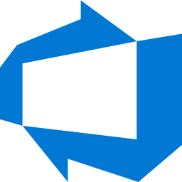
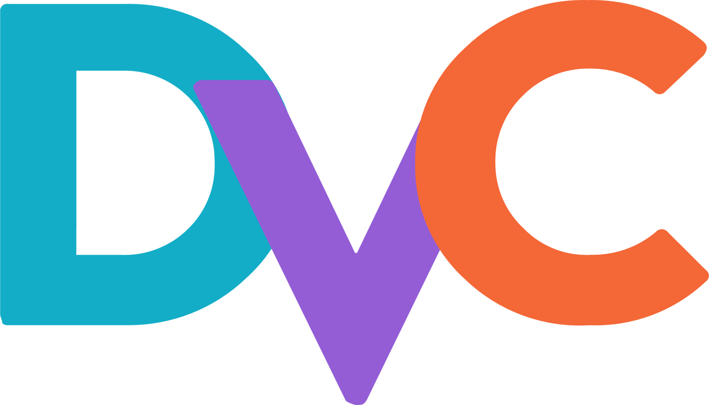
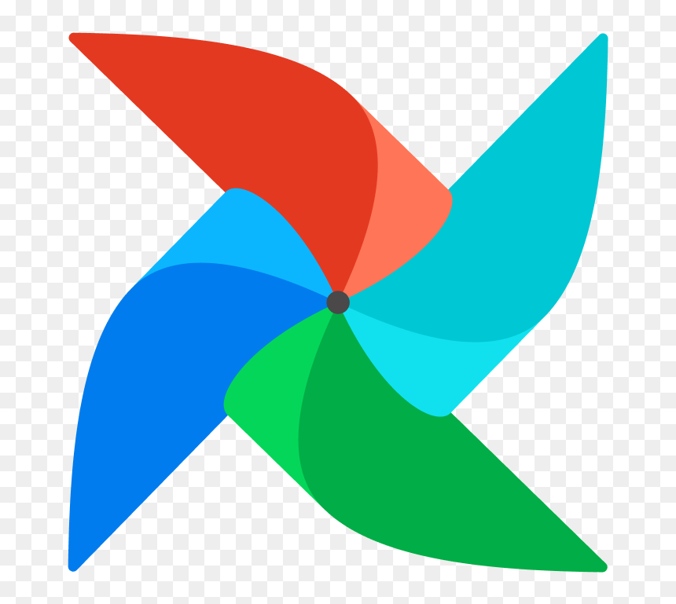
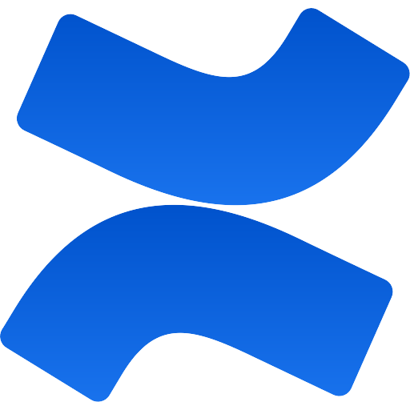
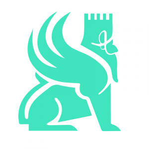
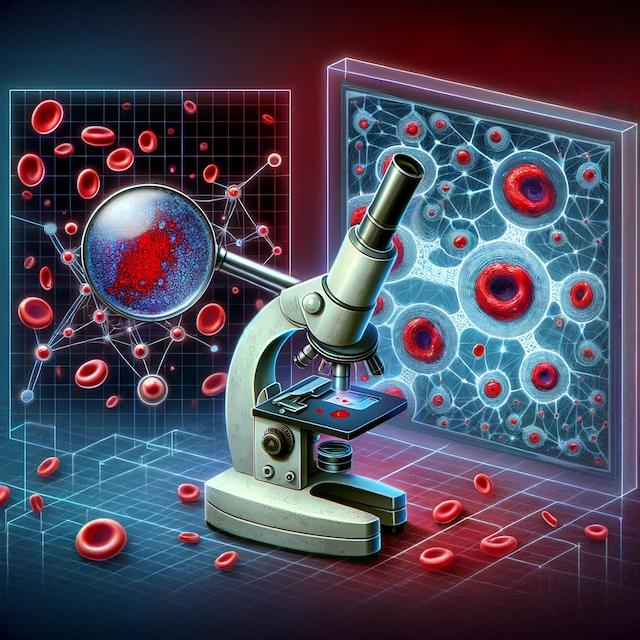

# Dr. Sadjad Sadeghi

**AI/ML Engineer | GenAI, RAG & Agentic AI | MLOps & ML Systems**

Founder & AI/ML Engineer at **[JadayLix Studio](https://jadaylix.com/en)** — my boutique AI software studio, building custom AI-enabled software and applied AI systems.  
PhD in Physics · Research in Computational Neuroscience · Hannover, Germany

I build LLM applications, retrieval and agent workflows, and ML systems with evaluation and deployment in mind. My work connects applied engineering with a research background in Bayesian modeling and nonlinear systems.

[Portfolio](https://sadeghi-ai.de/) · [JadayLix Studio](https://jadaylix.com/en) · [LinkedIn](https://www.linkedin.com/in/sadjadsadeghi/)

## Selected Engineering Work — 2026

These public repositories include portfolio applications, reference architectures and experiments. The status labels reflect the public implementation, including demo data and unfinished integrations.

<table>
<tr>
<td align="center"><a href="https://github.com/sadjad6/agentic-enterprise-rag-langgraph"> <strong>Agentic Enterprise RAG</strong></a></td>
<td align="center"><a href="https://github.com/sadjad6/predictive-maintenance-mlops-system"> <strong>Predictive Maintenance MLOps</strong></a></td>
<td align="center"><a href="https://github.com/sadjad6/agent_eval_lab"> <strong>Agent Evaluation Lab</strong></a></td>
</tr>
<tr>
<td align="center"><a href="https://github.com/sadjad6/self-improving-llm-kb"> <strong>Self-Improving LLM Knowledge Base</strong></a></td>
<td align="center"><a href="https://github.com/sadjad6/recsys-ml-platform"> <strong>Recommendation ML Platform</strong></a></td>
<td align="center"><a href="https://github.com/sadjad6/open-autonomous-research-lab"> <strong>Open Autonomous Research Lab</strong></a></td>
</tr>
</table>

*Original project artwork illustrates design concepts. Implementation status and limitations are described in each entry below and in its repository README.*

### [Agentic Enterprise RAG](https://github.com/sadjad6/agentic-enterprise-rag-langgraph)
**Portfolio application / RAG reference architecture**

Document Q&A with LangGraph orchestration, Weaviate hybrid retrieval and local/cloud LLM modes. Includes DE/EN handling, source citations, optional PII masking and token-based cost estimates; these controls do not establish GDPR compliance.

**Technologies:** Python · LangGraph · Weaviate · FastAPI · Ollama · React

### [Predictive Maintenance MLOps](https://github.com/sadjad6/predictive-maintenance-mlops-system)
**Portfolio ML/MLOps prototype · simulated sensor data**

Prefect workflows for data preparation, failure classification and remaining-useful-life modeling, with FastAPI endpoints and a Dash demo. Some serving paths use heuristic fallback predictions; example metrics and business scenarios are not achieved customer results.

**Technologies:** Python · scikit-learn · XGBoost · LightGBM · Prefect · FastAPI · Plotly Dash

### [Agent Evaluation Lab](https://github.com/sadjad6/agent_eval_lab)
**Experimental synthetic-policy evaluation framework**

One-step synthetic environments with a custom PPO-style policy trainer and threshold-based checkpoint evaluation. Includes distribution-shift datasets, seed controls and repeat-run comparisons; label-noise evaluation is only partially integrated.

**Technologies:** Python · PyTorch · NumPy · PyYAML

### [Self-Improving LLM Knowledge Base](https://github.com/sadjad6/self-improving-llm-kb)
**Portfolio retrieval and memory system**

FAISS/BM25 retrieval with Reciprocal Rank Fusion, stored Q&A interactions, summary notes and evaluation utilities. Summaries require manual reindexing; the system does not automatically retrain the model or demonstrate quality gains.

**Technologies:** Python · FAISS · rank-bm25 · sentence-transformers · MLflow

### [Recommendation ML Platform](https://github.com/sadjad6/recsys-ml-platform)
**Recommendation reference architecture · partial service integration**

FastAPI services, Kafka event publishing, Spark streaming code and MLflow model-loading paths. Redis feature persistence, online updates and automated deployment are incomplete; fixed recommendation fallbacks support the demo.

**Technologies:** Python · FastAPI · Kafka · Spark · Redis · MLflow · Kubernetes

### [Open Autonomous Research Lab](https://github.com/sadjad6/open-autonomous-research-lab)
**Experimental research workflow prototype**

A fixed workflow connects specialist components for data preparation, EDA, baseline ML comparison, evaluation summaries and templated reporting. Additional agents, skill packages, MCP and MLflow components are exploratory or not wired into the default workflow.

**Technologies:** Python · FastAPI · pandas · scikit-learn · Streamlit · Docker Compose

## Core Engineering

**GenAI & Agents:** LLM applications · RAG · LangGraph · LangChain · Hybrid retrieval · Evaluation  
**Machine Learning:** PyTorch · scikit-learn · Tabular modeling · Time series · Bayesian modeling  
**ML Systems & MLOps:** MLflow · Prefect · Docker · CI/CD configuration · Monitoring instrumentation  
**Backend & Data:** Python · FastAPI · PostgreSQL · Vector databases

  
  
  
  
  
  
  
  
  
  
  
  
  
  
  
  
  
  
  
  
  
  
  
  
  
  
  
  
  
  
  
  
  
  
  
  
  
  
  
  
  
  
  
  
  
  
  
  
  
  
  
  
  
  
  
  
  
  
  
  
  
  
  
  
  
  
  
  
  
  
  
  
  
  

## Research Foundation

PhD in Physics from Heidelberg University, with research in computational neuroscience, Bayesian inference and nonlinear systems. [Wilson–Cowan DCM research code](https://github.com/sadjad6/W-C_DCM1) explores dynamic causal modeling of fMRI and Bayesian model-family comparison using MATLAB/SPM.

## Credentials

<table>
  <tr>
    <td align="center">
      <a href="https://files.datascientest.com/diploma/1168720e-2438-4bf6-9cca-4930562ee26f.pdf">
        
         Machine Learning Engineer Diploma
      </a>
    </td>
    <td align="center">
      <a href="https://files.datascientest.com/diploma/32b1d4b9-6658-45e6-8716-a616479e7783.pdf">
        
         Data Science Diploma
      </a>
    </td>
    <td align="center">
      <a href="https://learn.microsoft.com/api/credentials/share/en-us/SadjadSadeghi-5193/75737191D3780AC0?sharingId=86425B7D613245BB">
        
         Azure Fundamentals
      </a>
    </td>
  </tr>
</table>

- PhD in Physics — Heidelberg University
- [Machine Learning Engineer — DataScientest](https://files.datascientest.com/diploma/1168720e-2438-4bf6-9cca-4930562ee26f.pdf)
- [Data Scientist — DataScientest](https://files.datascientest.com/diploma/32b1d4b9-6658-45e6-8716-a616479e7783.pdf)
- [Microsoft Certified: Azure Fundamentals](https://learn.microsoft.com/api/credentials/share/en-us/SadjadSadeghi-5193/75737191D3780AC0?sharingId=86425B7D613245BB)

<strong>More project artwork</strong>

Original artwork from earlier projects and design concepts. These images are retained as a visual archive, rather than additional claims of completed or deployed systems.

<table>
<tr>
<td align="center"> AegisClaims AI</td>
<td align="center"> FinSage: AI-Powered Financial Advisor</td>
<td align="center"> Personal Knowledge Management Agent</td>
</tr>
<tr>
<td align="center"> PDF Q&A RAG</td>
<td align="center"><a href="https://github.com/sadjad6/Text-Summarizer"><strong>Text-Summarizer</strong></a> <em>Original artwork source is unavailable.</em></td>
<td align="center"> Malaria Cell Classifier</td>
</tr>
<tr>
<td align="center"> Automated Nucleus Detector</td>
<td align="center"> Movie Recommendation Systems</td>
</tr>
</table>

