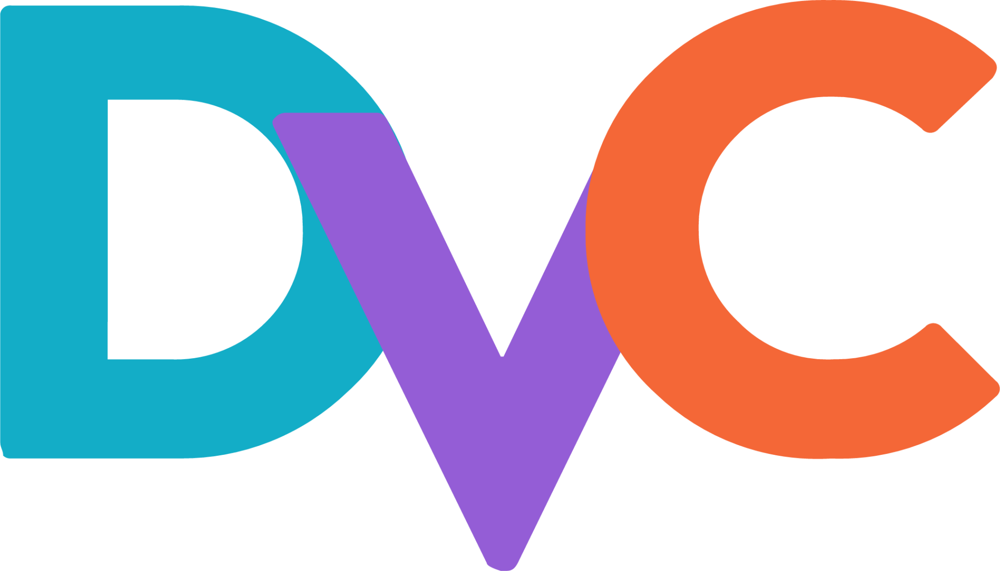
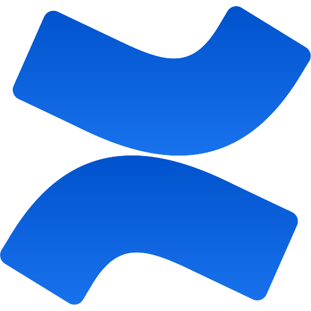

### Hello World, I'm Sadjad, Data Scientist | Machine Learning/MLOps Engineer | Computational Neuroscientist (Ph.D.)! 👋

- Data Scientist and MLOps Engineer with 8+ years in machine learning, data analysis, and brain simulations.
- Proficient in Python, TensorFlow, PyTorch, Keras, and computer vision (CNNs, OpenCV).
- Developed AI/ML solutions, including a real-time blood cell classification system.
- Skilled in Docker, Kubernetes, AWS, and Azure with CI/CD automation (Git, GitHub Actions, Azure DevOps).
- Expertise in SQL, NoSQL (MongoDB), and data visualization (Matplotlib, Seaborn, Plotly).
- Experience with cloud monitoring using Prometheus and Grafana.
- Published research applying machine learning to fMRI data and Bayesian modeling.
- Developed APIs and deployment pipelines with Flask, FastAPI, Docker, and Terraform.
- Passionate about using AI/ML to solve complex problems in healthcare and finance.
- Open to collaborations on projects related to data science, MLOps, AI/ML pipelines.

<h3 align="left">Connect with me:</h3>

---

### 🏅 Professional Badges and Credentials

  <a href="https://files.datascientest.com/diploma/1168720e-2438-4bf6-9cca-4930562ee26f.pdf" style="display: inline-block; text-align: center; margin: 10px;">
     Machine Learning Engineer Diploma
  </a>
  
  <a href="https://files.datascientest.com/diploma/32b1d4b9-6658-45e6-8716-a616479e7783.pdf" style="display: inline-block; text-align: center; margin: 10px;">
     Data Science Diploma
  </a>
  
  <a href="https://learn.microsoft.com/api/credentials/share/en-us/SadjadSadeghi-5193/75737191D3780AC0?sharingId=86425B7D613245BB" style="display: inline-block; text-align: center; margin: 10px;">
     Azure Fundamentals
  </a>

---
<h3 align="left">Skills:</h3>

  <!-- Python -->
   
  <!-- Pandas -->
   
  <!-- NumPy -->
  
  <!-- SciPy -->
  
  <!-- Scikit-learn -->
  
  <!-- Flask -->
  
  <!-- FastAPI -->
  
  <!-- TensorFlow -->
   
  <!-- Keras -->
  
  <!-- PyTorch -->
  
  <!-- OpenCV -->
   
  <!-- Microsoft Azure -->
   
  <!-- AWS -->
   
  <!-- Matplotlib -->
  
  <!-- Seaborn -->
  
  <!-- Plotly -->
  
  <!-- MongoDB -->
   
  <!-- SQL -->
  
  <!-- Docker -->
   
  <!-- Kubernetes -->
  
  <!-- Terraform -->
  
  <!-- Helm -->
  
  <!-- Git -->
  
  <!-- GitHub -->
  
  <!-- Azure DevOps -->
  
  <!-- MLflow -->
  
  <!-- DVC -->
  
  <!-- Airflow -->
  
  <!-- Bash -->
   
  <!-- Linux -->
   
  <!-- Windows -->
  
  <!-- Prometheus -->
  
  <!-- Grafana -->
  
  <!-- Jira -->
  
  <!-- Confluence -->
  
  <!-- VS Code -->
  
  <!-- Streamlit -->
  

&nbsp;

---

### Projects

<table>
  <tr>
    <th>Projects</th>
    <th>Techniques</th>
    <th>Data Types</th>
    <th>Poster</th>
  </tr>
<tr>
    <td>
      <a href="https://github.com/sadjad6/CNN-Predictor-for-Malaria_Cells-LIME-CAM.git"><strong>Malaria Cell Classifier</strong></a> 
      <em>Deep Convolutional Neural Networks and Machine Learning Models for Anomaly Detection in Microscopic Malaria cells.</em>
    </td>
    <td>Deep CNN, Data Augmentation, Feature Engineering, Image Processing, Optimization</td>
    <td>Image</td>
    <td></td>
  </tr>
  <tr>
    <td>
      <a href="https://github.com/sadjad6/Automated-Cell-Semantic-Segmentation-with-UNet.git"><strong>Automated Nucleus Detector</strong></a> 
      <em>A Semantic Segmentation Solution for Automating Nucleus Detection of Microscopic Biomedical Images.</em>
    </td>
    <td>U-Net, Keras-tunner, Semantic Segmentation</td>
    <td>Image</td>
    <td></td>
  </tr>
  </table>
